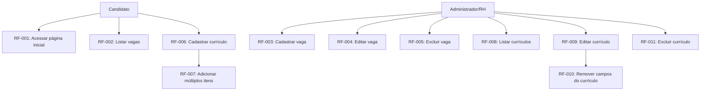
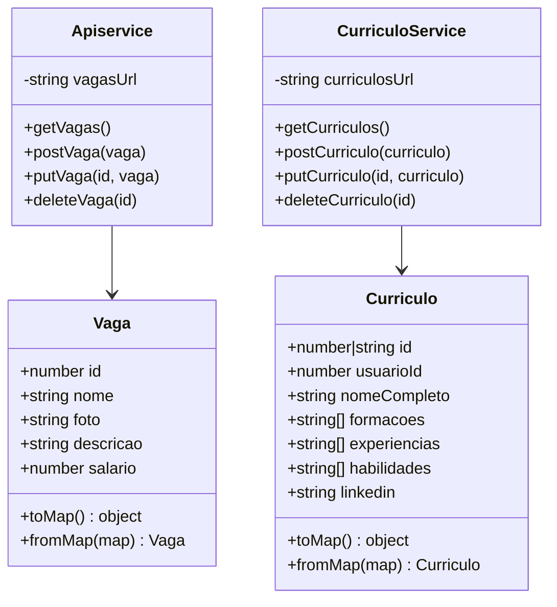
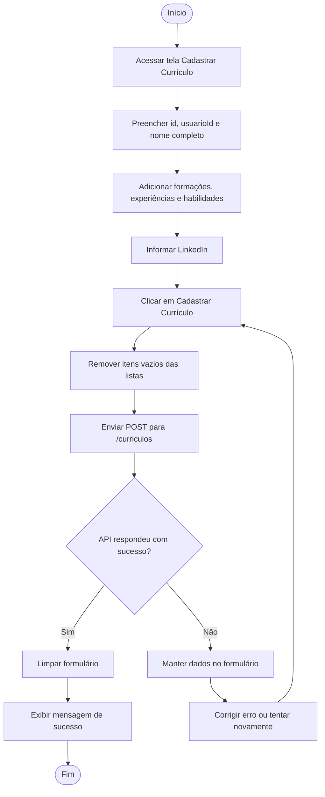
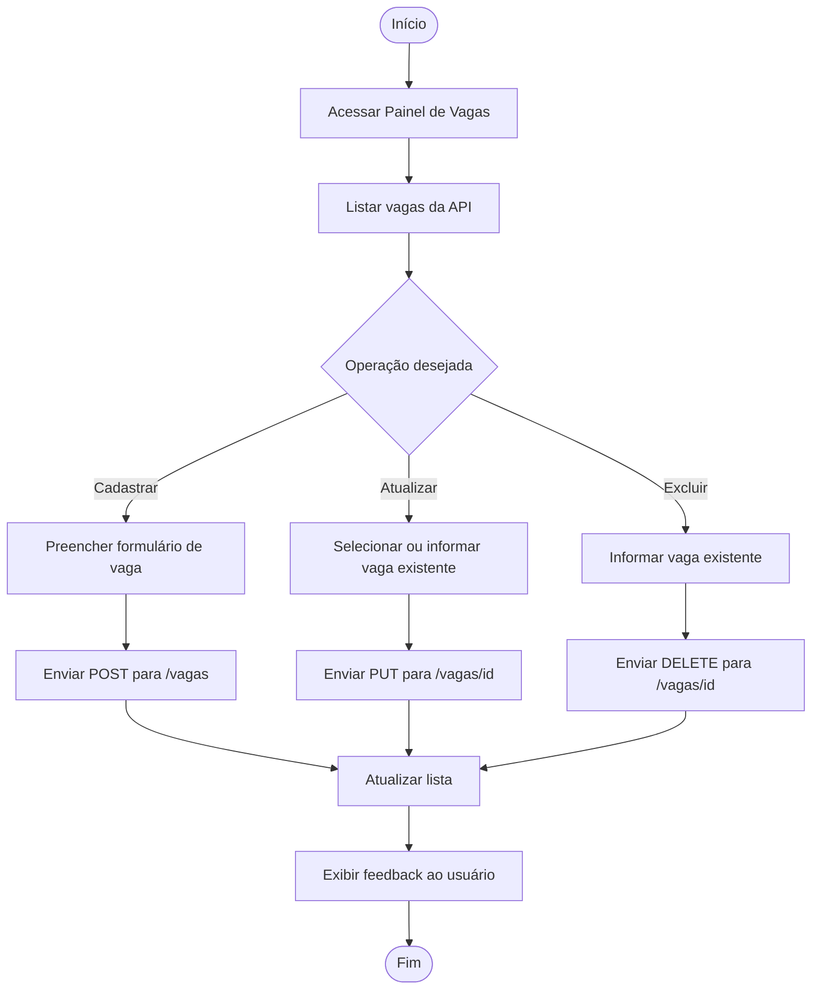

# Documentação de Requisitos de Software (DRS / SRS) - SA RH Completa

**Projeto:** SA RH Completa
**Sistema:** Portal RH - Vagas e Currículos
**Padrão de referência:** ISO/IEC/IEEE 29148:2018
**Versão:** 1.0.0
**Data:** 16/06/2026
**Tecnologias principais:** Angular 21, TypeScript, SCSS, RxJS e json-server

---

## 1. Introdução

### 1.1 Finalidade

Este documento especifica os requisitos de software do projeto **SA RH Completa**, uma aplicação web desenvolvida em Angular para consulta e gerenciamento de vagas e currículos.

A documentação segue a estrutura de uma especificação de requisitos inspirada na ISO/IEC/IEEE 29148:2018, contemplando finalidade, escopo, perspectiva do produto, requisitos funcionais, requisitos não funcionais, regras de negócio, modelos de dados, diagramas e instruções de execução.

### 1.2 Escopo do Sistema

O sistema tem como objetivo centralizar funcionalidades básicas de um portal de recursos humanos, permitindo que candidatos visualizem vagas, cadastrem currículos e que a administração mantenha registros de vagas e currículos em uma API simulada.

**O que está no escopo:**

- Visualização pública de vagas cadastradas.
- Cadastro de currículos por candidatos.
- Listagem, edição e remoção de currículos.
- Cadastro, edição, listagem e exclusão de vagas em painel administrativo.
- Integração com backend simulado via `json-server`.
- Persistência dos dados no arquivo `backend/db.json`.

**O que está fora de escopo:**

- Login e autenticação de usuários.
- Controle de permissões por perfil.
- Candidatura formal de um currículo para uma vaga específica.
- Envio de e-mail ou notificações.
- Upload real de imagens.
- Integração com banco de dados relacional ou API externa real.
- Processo seletivo completo com etapas, entrevistas e aprovações.

### 1.3 Definições, Acrônimos e Siglas

| Termo | Definição |
| --- | --- |
| **DRS** | Documento de Requisitos de Software. |
| **SRS** | Software Requirements Specification. |
| **RH** | Recursos Humanos. |
| **CRUD** | Operações de criar, ler, atualizar e excluir dados. |
| **API** | Interface de Programação de Aplicações. |
| **json-server** | Ferramenta usada para simular uma API REST a partir de um arquivo JSON. |
| **SPA** | Single Page Application, aplicação web de página única. |

### 1.4 Visão Geral do Documento

Este documento apresenta a descrição geral do produto, as características dos usuários, os requisitos funcionais e não funcionais, as regras de negócio, a modelagem dos dados, os diagramas principais e as instruções para instalação e execução do projeto.

---

## 2. Descrição Geral

### 2.1 Perspectiva do Produto

O **SA RH Completa** é uma aplicação web frontend criada com Angular. O projeto consome uma API REST simulada em `http://localhost:3027`, usando os recursos `/vagas` e `/curriculos`.

A aplicação atua como um portal simples de RH, com telas públicas para consulta e cadastro e telas de painel para manutenção dos registros.

### 2.2 Classes e Características dos Usuários

| Usuário | Descrição | Principais ações |
| --- | --- | --- |
| **Candidato** | Pessoa interessada em consultar oportunidades e cadastrar seu currículo. | Visualizar vagas e cadastrar currículo. |
| **Administrador/RH** | Pessoa responsável por manter vagas e consultar currículos. | Cadastrar, editar e excluir vagas; listar, editar e excluir currículos. |

### 2.3 Premissas e Dependências

- O usuário deve ter Node.js e npm instalados.
- A aplicação Angular deve estar em execução para acesso ao frontend.
- O `json-server` deve estar em execução na porta `3027` para que as operações de vagas e currículos funcionem.
- As URLs dos serviços estão configuradas para `http://localhost:3027/vagas` e `http://localhost:3027/curriculos`.
- Os dados cadastrados dependem da disponibilidade e integridade do arquivo `backend/db.json`.

---

## 3. Requisitos do Sistema

### 3.1 Requisitos Funcionais (RF)

| ID | Requisito | Descrição | Prioridade |
| --- | --- | --- | --- |
| **RF-001** | Visualizar página inicial | O sistema deve exibir uma página inicial com apresentação do Portal RH e atalhos para vagas, cadastro de currículo e painel de currículos. | Essencial |
| **RF-002** | Listar vagas | O sistema deve permitir visualizar as vagas cadastradas com código, nome, foto, descrição e salário. | Essencial |
| **RF-003** | Cadastrar vaga | O sistema deve permitir cadastrar uma vaga contendo id, nome, foto, descrição e salário. | Essencial |
| **RF-004** | Editar vaga | O sistema deve permitir atualizar os dados de uma vaga existente. | Essencial |
| **RF-005** | Excluir vaga | O sistema deve permitir excluir uma vaga cadastrada. | Essencial |
| **RF-006** | Cadastrar currículo | O sistema deve permitir cadastrar currículo contendo id, id do usuário, nome completo, formações, experiências, habilidades e LinkedIn. | Essencial |
| **RF-007** | Adicionar múltiplos itens ao currículo | O sistema deve permitir adicionar múltiplas formações, experiências e habilidades no formulário de currículo. | Importante |
| **RF-008** | Listar currículos | O sistema deve exibir os currículos cadastrados com nome completo, formações, experiências, habilidades e link para LinkedIn. | Essencial |
| **RF-009** | Editar currículo | O sistema deve permitir selecionar um currículo existente e alterar seus dados. | Essencial |
| **RF-010** | Remover campos do currículo | O sistema deve permitir remover formações, experiências e habilidades durante a edição, mantendo ao menos um campo por categoria no formulário. | Importante |
| **RF-011** | Excluir currículo | O sistema deve permitir excluir um currículo cadastrado. | Essencial |
| **RF-012** | Persistir dados | O sistema deve salvar vagas e currículos no backend simulado `json-server`. | Essencial |
| **RF-013** | Exibir feedback de operação | O sistema deve exibir uma mensagem ao usuário após cadastro, atualização ou exclusão de vaga ou currículo. | Importante |

### 3.2 Requisitos Não Funcionais (RNF)

| ID | Requisito | Descrição | Categoria |
| --- | --- | --- | --- |
| **RNF-001** | Usabilidade | A interface deve disponibilizar navegação simples entre página inicial, vagas, cadastro de currículo e painéis. | Usabilidade |
| **RNF-002** | Desempenho | As listagens de vagas e currículos devem carregar em até 2 segundos em ambiente local com o `json-server` ativo. | Eficiência |
| **RNF-003** | Manutenibilidade | O código deve manter separação entre modelos, serviços e componentes de visualização. | Manutenibilidade |
| **RNF-004** | Compatibilidade | O sistema deve funcionar em navegadores modernos compatíveis com aplicações Angular. | Portabilidade |
| **RNF-005** | Integridade dos dados | Os dados enviados aos serviços devem preservar a estrutura esperada pelos modelos `Vaga` e `Curriculo`. | Confiabilidade |
| **RNF-006** | Disponibilidade local | As funcionalidades de CRUD devem estar disponíveis enquanto o frontend e a API simulada estiverem em execução local. | Confiabilidade |
| **RNF-007** | Legibilidade | O projeto deve manter nomes de arquivos, classes e métodos coerentes com suas responsabilidades. | Manutenibilidade |

---

## 4. Regras de Negócio

| ID | Regra | Descrição |
| --- | --- | --- |
| **RN-001** | Vaga deve possuir identificador | Cada vaga deve possuir um `id` para que possa ser atualizada ou excluída. |
| **RN-002** | Vaga deve possuir dados principais | Cada vaga deve conter nome, foto, descrição e salário. |
| **RN-003** | Currículo deve possuir identificador | Cada currículo deve possuir um `id` para edição e exclusão. |
| **RN-004** | Currículo deve estar vinculado a usuário | Cada currículo deve conter `usuarioId`, permitindo associar o registro a um usuário. |
| **RN-005** | Listas de currículo devem remover campos vazios | Antes de salvar, formações, experiências e habilidades vazias devem ser removidas. |
| **RN-006** | Edição de currículo deve preservar listas | Ao editar um currículo, suas listas de formações, experiências e habilidades devem ser carregadas para edição. |
| **RN-007** | Feedback após operação | Cadastros, atualizações e exclusões devem informar o resultado da operação ao usuário. |

---

## 5. Interface de Dados e Modelagem do Sistema

### 5.1 Entidade Vaga

| Campo | Tipo | Descrição |
| --- | --- | --- |
| `id` | `number` | Identificador da vaga. |
| `nome` | `string` | Nome ou título da vaga. |
| `foto` | `string` | Nome do arquivo de imagem relacionado à vaga. |
| `descricao` | `string` | Descrição resumida da oportunidade. |
| `salario` | `number` | Salário informado para a vaga. |

### 5.2 Entidade Currículo

| Campo | Tipo | Descrição |
| --- | --- | --- |
| `id` | `number \| string` | Identificador do currículo. |
| `usuarioId` | `number` | Identificador do usuário associado ao currículo. |
| `nomeCompleto` | `string` | Nome completo do candidato. |
| `formacoes` | `string[]` | Lista de formações acadêmicas ou cursos. |
| `experiencias` | `string[]` | Lista de experiências profissionais ou práticas. |
| `habilidades` | `string[]` | Lista de habilidades do candidato. |
| `linkedin` | `string` | URL do perfil do LinkedIn. |

### 5.3 Recursos da API Simulada

| Recurso | URL | Operações |
| --- | --- | --- |
| Vagas | `http://localhost:3027/vagas` | `GET`, `POST`, `PUT`, `DELETE` |
| Currículos | `http://localhost:3027/curriculos` | `GET`, `POST`, `PUT`, `DELETE` |

---

## 6. Diagramas de Engenharia de Software

### 6.1 Diagrama de Casos de Uso



### 6.2 Diagrama de Classes



### 6.3 Diagrama de Fluxo - Cadastro de Currículo



### 6.4 Diagrama de Fluxo - Manutenção de Vagas



---

## 7. Configuração e Execução do Ambiente

### 7.1 Pré-requisitos

- Node.js instalado.
- npm instalado.
- Angular CLI disponível via `npx` ou instalado globalmente.

### 7.2 Instalar Dependências

```bash
npm install
```

### 7.3 Executar o Backend Simulado

O projeto espera que a API esteja disponível na porta `3027`.

```bash
npx json-server --watch backend/db.json --port 3027
```

### 7.4 Executar o Frontend

Em outro terminal, execute:

```bash
npm start
```

Depois acesse:

```text
http://localhost:4200
```

### 7.5 Rotas Principais

| Rota | Componente | Finalidade |
| --- | --- | --- |
| `/` | `Home` | Página inicial do portal. |
| `/vagas` | `Vagas` | Listagem pública de vagas. |
| `/painel-vagas` | `PainelVagas` | CRUD de vagas. |
| `/curriculo-form` | `CurriculoForm` | Cadastro de currículo. |
| `/curriculo-list` | `CurriculoList` | Listagem, edição e exclusão de currículos. |

### 7.6 Comandos Úteis

```bash
npm start
npm run build
npm test
```

---

## 8. Controle de Versões

| Versão | Data | Descrição |
| --- | --- | --- |
| 1.0.0 | 16/06/2026 | Criação da documentação de requisitos do SA RH Completa com base no projeto Angular, nos READMEs de referência e na ISO/IEC/IEEE 29148:2018. |
