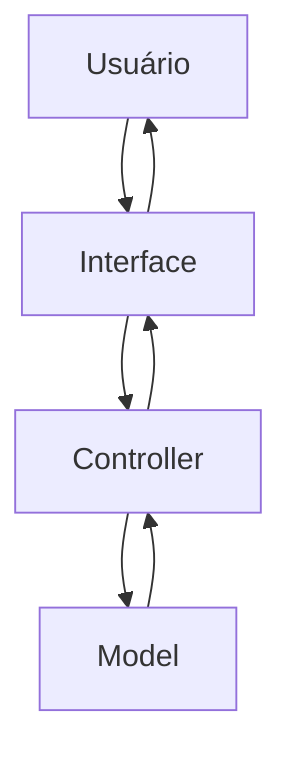
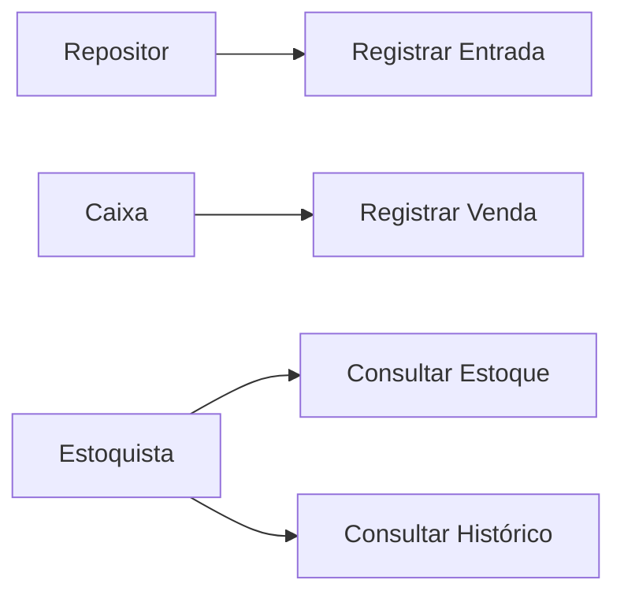
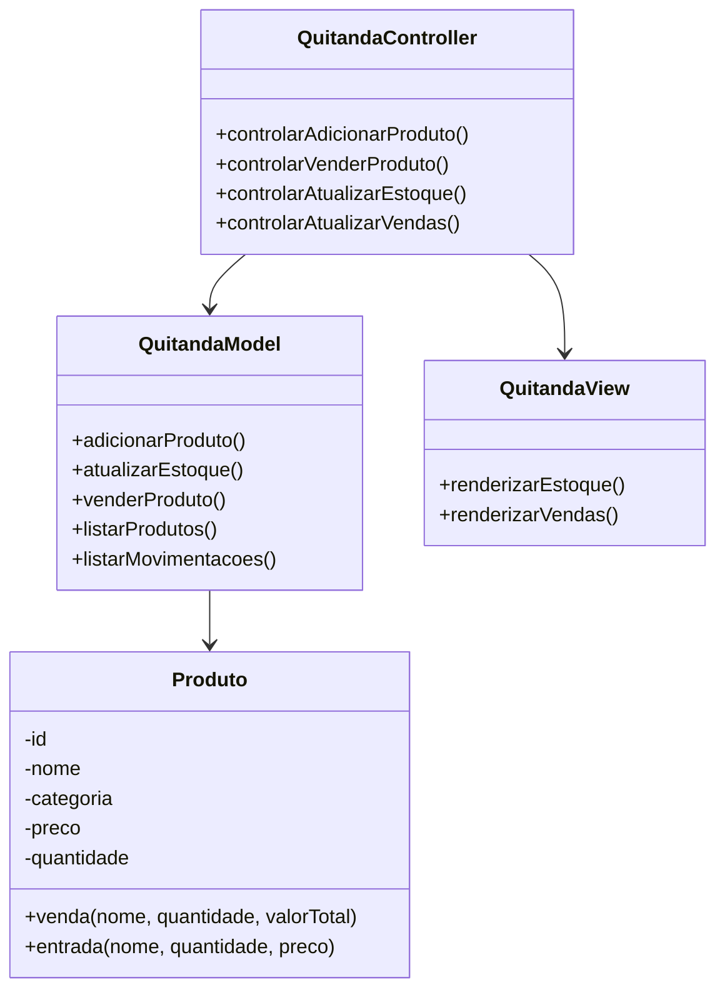
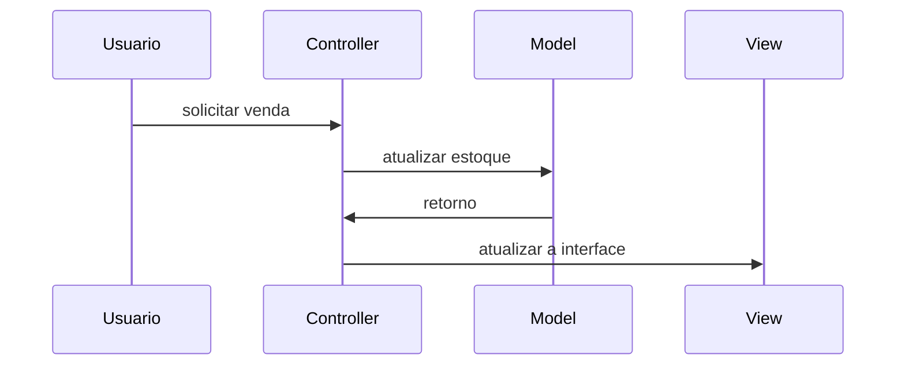

# Documentação de Especificação de Requisitos de Software (SRS)

## Sistema de Gestão de Quitanda (Quitanda MVC)

**Padrão Internacional:** ISO/IEC/IEEE 29148:2018  
**Versão:** 1.0.0  
**Data:** 2026-04-14  
**Autor:** Murilo Dovigo Bastos

---

## 1. Introdução

### 1.1 Propósito

Este documento descreve os requisitos do sistema **Quitanda MVC**, com o objetivo de:

- definir funcionalidades;
- padronizar o entendimento entre os stakeholders;
- servir como base para desenvolvimento e testes.

---

### 1.2 Escopo

O sistema permitirá:

- registro de entrada de produtos;
- registro de vendas;
- controle de estoque;
- histórico de movimentações.

O sistema será uma aplicação web frontend utilizando:

- HTML;
- CSS;
- JavaScript;
- arquitetura MVC;
- estrutura POO.

---

### 1.3 Definições

| Termo | Definição |
| ----- | --------- |
| Produto | Item comercializado na quitanda |
| Entrada | Registro de chegada de produto |
| Venda | Registro de saída de produto |
| Estoque | Quantidade disponível de produtos |

Acrônimos:

- **SGQ** - Sistema de Gestão de Quitanda
- **RF** - Requisito Funcional
- **RNF** - Requisito Não Funcional

---

### 1.4 Visão Geral do Documento

Este documento está organizado em:

- introdução e visão geral;
- descrição do sistema;
- requisitos detalhados;
- modelos UML;
- regras de negócio.

---

## 2. Descrição Geral do Sistema

### 2.1 Perspectiva do Sistema

O sistema é standalone, ou seja, funciona no frontend e opera em um navegador web.

---

### 2.2 Funções do Sistema

O sistema deve:

- cadastrar produtos;
- atualizar estoque;
- registrar vendas;
- validar operações;
- exibir dados.

---

### 2.3 Classes de Usuários

| Usuário | Descrição |
| ------- | --------- |
| Estoquista | Gerencia o estoque |
| Caixa | Realiza vendas |
| Repositor | Registra entradas |

---

### 2.4 Ambiente Operacional

- Navegadores web: Chrome, Edge e Firefox.

---

### 2.5 Restrições

- Não utiliza banco de dados;
- os dados são armazenados na memória;
- não possui autenticação de usuário.

### 2.6 Suposições

- O usuário possui conhecimentos básicos de informática;
- o volume de dados é pequeno.

---

## 3. Requisitos do Sistema

### 3.1 Requisitos Funcionais

#### RF-001: Cadastro de Produto

**Descrição:** Permitir o cadastro de produtos.

- **Prioridade:** Alta
- **Versão:** 1.0
- **Data:** 2026-04-14
- **Rastreabilidade:** Necessidade do Stakeholder 001

**Critérios de Aceitação:**

- [ ] Entrada de dados: nome, categoria, preço e quantidade
- [ ] Validação dos campos
- [ ] Verificação de duplicidade
- [ ] Saída: notificação ao usuário

---

#### RF-002: Atualização de Estoque

**Descrição:** Permitir a atualização de dados de itens existentes.

- **Prioridade:** Alta
- **Versão:** 1.0
- **Data:** 2026-04-14
- **Rastreabilidade:** Necessidade do Stakeholder 002

**Critérios de Aceitação:**

- [ ] Verificar se o item já está cadastrado
- [ ] Entrada de dados: nome, categoria, preço e quantidade
- [ ] Validação dos campos
- [ ] Saída: notificação ao usuário

---

#### RF-003: Listagem de Estoque

**Descrição:** Exibir informações dos produtos cadastrados.

- **Prioridade:** Alta
- **Versão:** 1.0
- **Data:** 2026-04-14
- **Rastreabilidade:** Necessidade do Stakeholder 003

**Critérios de Aceitação:**

- [ ] Listagem dos produtos
- [ ] Saída: ID, nome, categoria, preço e quantidade

---

#### RF-004: Registro de Vendas

**Descrição:** Permitir a venda de produtos.

- **Prioridade:** Alta
- **Versão:** 1.0
- **Data:** 2026-04-14
- **Rastreabilidade:** Necessidade do Stakeholder 004

**Critérios de Aceitação:**

- [ ] Venda de produtos cadastrados
- [ ] Verificação de quantidade
- [ ] Atualização do estoque
- [ ] Notificação de venda realizada

---

#### RF-005: Histórico de Movimentações

**Descrição:** Permitir o registro de movimentações de entrada e saída de produtos.

- **Prioridade:** Média
- **Versão:** 1.0
- **Data:** 2026-04-14
- **Rastreabilidade:** Necessidade do Stakeholder 005

**Critérios de Aceitação:**

- [ ] Registro das movimentações em uma lista
- [ ] Consulta das movimentações
- [ ] Verificação de duplicidade
- [ ] Saída: notificação ao usuário

---

### 3.2 Requisitos Não Funcionais

#### RNF-001: Usabilidade

**Descrição:** Interface simples e intuitiva.

---

#### RNF-002: Desempenho

**Descrição:** Respostas rápidas, inferiores a 1 segundo.

---

#### RNF-003: Arquitetura MVC

**Descrição:** Estruturação da arquitetura do código no padrão MVC.

---

#### RNF-004: Confiabilidade

**Descrição:** Validação obrigatória da entrada de dados.

---

## 4. Regras de Negócio

Tabela de Regras de Negócio

| Regra de Negócio | Descrição |
| ---------------- | --------- |
| RN-001 | A quantidade de produtos não pode ser negativa |
| RN-002 | O preço do produto não pode ser negativo |
| RN-003 | O nome do produto é obrigatório |
| RN-004 | A venda só pode ser realizada se o estoque for suficiente |
| RN-005 | Toda movimentação deve ser registrada |

---

Podem existir restrições para o negócio, como restrições legais, de movimentação ou locais.

---

## 5. Modelos do Sistema

### 5.1 Diagrama de Casos de Uso

Diagrama de casos de uso: apresenta o que o sistema deve fazer do ponto de vista do usuário.

### 5.2 Diagrama de Classes UML

Diagrama de classes UML: apresenta a estrutura do código, classes, atributos e métodos.

---

### 5.3 Diagrama de Sequência

Diagrama de Sequência: Interção entre objetos ao longo do tempo, para realizar uma funcionalidade específica

#### 5.3.1 Venda

## 6. Análise de Risco

### 6.1 Matriz de Análise de Risco

| Risco | Impacto | Mitigação |
| - | - | - |
| Perda de Dados | Alto | usar LocalStorage |
| Entrada de Dados | Média | Validar as Entradas de Dados |

---

## 7. Controle de Versões

### 7.1 Histórico de Alterações

| Versão | Data | Autor | Modificação |
| - | - | - | - |
| 1.0.0 | 2026-04-28 | Muri | Versão Inicial |

### 7.2 Aprovações
| Papel | Nome | Data | Assinatura |
| - | - | - | - |
| Stakeholder | Seu Joaquim | 2026-04-29 | [] |
