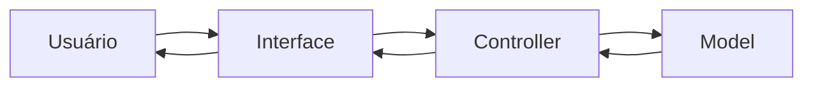

# Documentação de Especificações de Requistos de Software (SRS)

## Sistema de Gestão de Quitanda (Quitanda MVC)

**Padrão Internacional:** ISO/IEC/IEEE 29148:2018
**Versão:** 1.0.0
**Data:** 2026-04-14
**Autor:** Muski

---

## 1. Introdução

### 1.1 Propósito

Este Documento descreve os requisitos do sistema **Quitanda MVC**, com o objetivo de:

* Definir funcionalidades;
* Padrionizar entendimentos entre os stakeholders;
* Servir como base para desenvolvimento e teste.

---

### 1.2 Escopo

O sistema permitirá:

* Registro de entrada de produtos
* Controle de estoque
* Registro de vendas
* Visualização do histórico das movimentações

O Sistema será uma aplicação web frontend utilizando:

* HTML
* CSS
* JavaScript
* Arquitetura MVC
* Estrutura POO

Objetivos:

---

### 1.3 Definições e Acrônimos

| Termo | Definição |
| - | - |
| Produto | Item Comercializado na quitanda |
| Entrada | Registro de chegada de produto |
| Saída | Registro de venda de produto |
| Estoque | Quantidade disponível de produto |
|  |  |

Lista de Acrônimos

* **SGQ:** Sistema de Gestão de Quitanda
* **RF:** Requisitos Funcionais
* **RNF:** Requisitos Não Funcionais
* **UC:**  Casos de Uso
* **CA:** Critérios de Aceitação
---

### 1.4 Visão Geral do Documento

Este documento esta organizado em 

* introdução e visão geral
* descrição do sistema
* requisitos detalhados 
* modelos UML
* regras de negócio

---

## 2. Descrição Geral do Sistema

### 2.1 Perspectiva do Sistema

O sistema é **standalone** (frontend), operado em navegador

---

### 2.2 Funções do Sistema

O Sistema deve:

* Cadastrar produtos
* Atualizar estoque
* registrar vendas
* Validar operações
* Exibir dados

---

### 2.3 Classes de Usuários

| Usuários | Descrição |
| - | - |
| Estoquista | Gerencia estoque |
| Caixa | Realiza Vendas |
| Repositor | Registra entradas |
|  |  |

---

### 2.4 Ambiente Operacional

* Navegadores Web (Chromium, Firefox)

---

### 2.5 Restrições

* Não utiliza Banco de Dados
* Dados armazenados na memória
* Não há autenticação

---

### 2.6 Suposições

* Usuário possui conhecimento de informática
* Volume de dados pequeno

---

## 3. Requisitos do Sistema